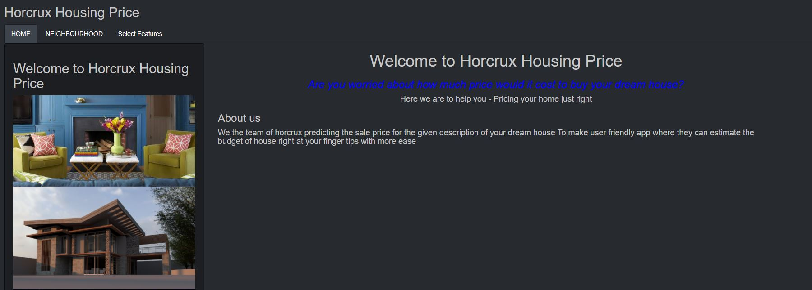

# House_Price_Prediction
A Linear regression project to predict the selling price of a house. Data set contained features of house using which we predicted the price. Dataset was taken from kaggle. An R-Shiny UI was built for this project.

*Data Description*
- The dataset is downloaded from kaggle.
- It contains 1460 rows and 81 different features of a house. 

*Presentation of the project*
The ppt of is uploaded in slideshare and the link is shared below
 https://www.emaze.com/@AOZFWIFTL/prediction-of-housing-price
 
*Screenshots of the application*

*User Interface Link* - https://hemanthk701.shinyapps.io/r_shiny_house_final/
